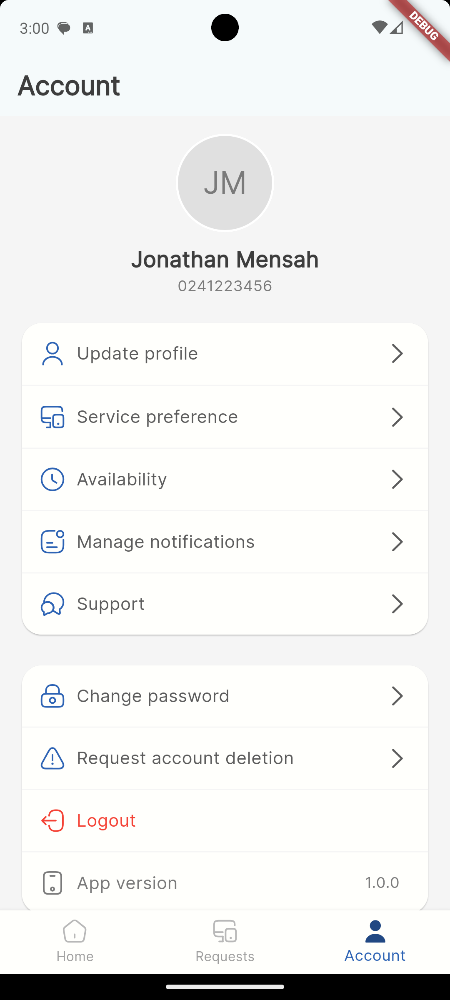
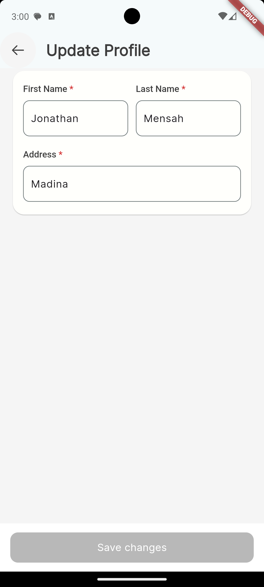

# Flutter Profile Management App

A Flutter application demonstrating clean architecture with user profile management features. Built using Provider for state management and GoRouter for navigation.

## Features

- User profile management
- Form validation
- Clean architecture
- Unit tests
- Widget tests

## Screenshots

| Account Screen | Update Profile |
|---------------|----------------|
|  |  |

## Getting Started

### Prerequisites

- Flutter SDK (>=3.0.0)
- Dart SDK (>=3.0.0)
- Android Studio / VS Code
- Android Emulator / iOS Simulator

### Installation

1. Clone the repository
```bash
git clone https://github.com/gidcode/new_my_app.git
```

2. Navigate to project directory
```bash
cd new_my_app
```

3. Get dependencies
```bash
flutter pub get
```

4. Run the app
```bash
flutter run
```

### Running Tests

To run all tests:
```bash
flutter test
```

To run tests with coverage:
```bash
flutter test --coverage
```

## Project Structure

```
lib/
  ├── config/        # Project Configuration
  ├── core/          # Core UI Components
  ├── data/          # Data layer
  ├── navigation/    # Navigation
  ├── models/        # Domain models
  ├── ui/            # UI layer
  │   ├── account/   # Account features
  │   └── shared/    # Shared UI components
  └── utils/         # Utilities
```

